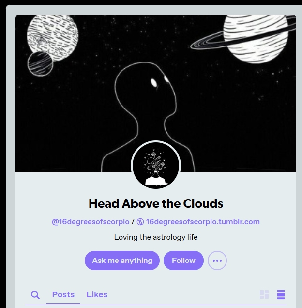
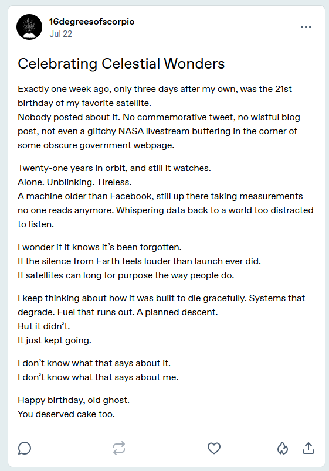
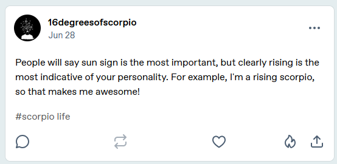
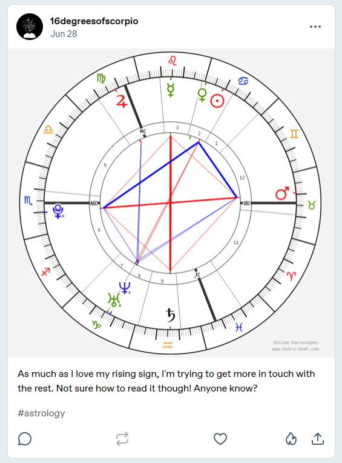
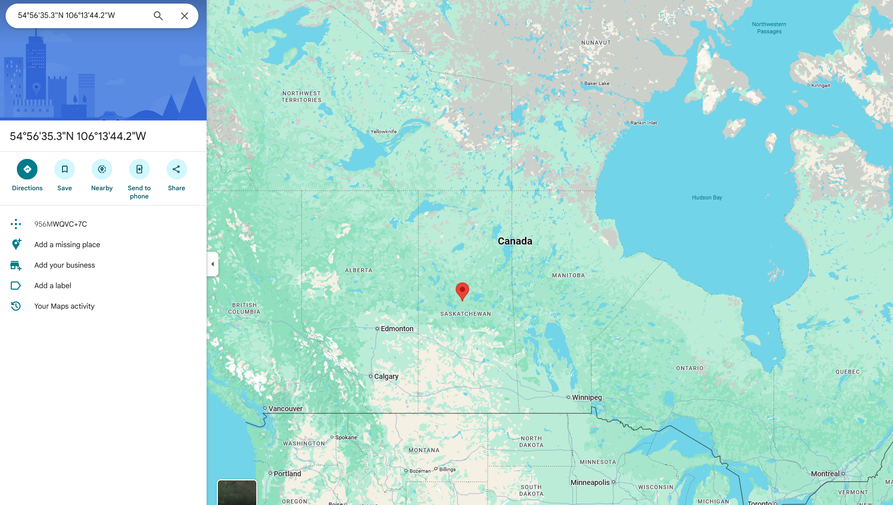

# "Age of Aquarius" Solution Writeup

This is a writeup is for the challenge "Age of Aquarius", the third of an OSINT challenge suite for UIUCTF 2025. I was inspired to write this challenge after my sister asked me to join the astrology app [Co-Star](https://www.costarastrology.com/), which upon installation, asks you for your birthday, birth time, and location of birth. I figured if they could determine a horoscope from all that information, it must be reversible.

Looking back, this was definitely more of a Rev/Misc/OSINT challenge (if that makes any sense) than a traditional OSINT, but I hope folks still had fun solving it and will now maybe think twice about sharing horoscope information publicly (or at least make an active choice about it).

## Challenge

This challenge sticks within the scope of the `@16egreesofscorpio` user we got from the "Bad Blood" challenge:


Additionally, we get a new challenge description:

```
Now that we know about Mr. Blue Sky's troll, we can learn more about her. It looks like she's got a birthday party coming up, can you figure out in which country (and province or state, if relevant)?

If you have not completed "Bad Blood", I recommend beginning there.

Flag format: uiuctf{country, state/province} or uiuctf{country, none} (like the word "none") if no province or state.
```

So it looks like we need to find a birthday party location. Where might that be? A good place to start looking is the [linked Tumblr account](https://www.tumblr.com/16degreesofscorpio):



If you look around, you'll find a post referencing the birthday party that tells us it's close to where they were born:


It also seems like the birthday is sometime in July. We can confirm this with a separate post:



Based on the date of the post, we can determine that this satellite was "born" on July 15. It's not crucial to the challenge (though figuring this out does make it a bit easier to pinpoint a date for those in different timezones), but in case you were curious, the satellite in question was [Aura](https://en.wikipedia.org/wiki/Aura_(satellite)), which measures the ozone layer. Anyways, if Aura's birthday was July 15, our target's birthday must be July 18.

We can get their rising sign (the afformentioned "16 degrees of scorpio") from another post:

.

It's starting to seem like we have a lot of information about this person's horoscope signs and birthday. We only get more with the posting of their birthchart:



At this point, the sheer amount of information might seem overwhelming. Which of this do we actually need to find the user's location? Using an [online astrology reverese engineering tool](https://horoscopes.astro-seek.com/calculate-reverse-engineering-chart), it looks like we need the sun, moon, saturn, rising, and midheaven signs.

The precision required for the solve isn't very granular, so we can assume a bit of leeway was given with the degrees, but we still have to read the chart for some of the more exact information. The intended solve uses [these coordinates](https://horoscopes.astro-seek.com/calculate-reverse-engineering-chart/?znameni1_navrat=rak&znameni1_stupen=21&znameni1_minuta=00&znameni2_navrat=kozoroh&znameni2_stupen=0&znameni2_minuta=00&znameni2_sekunda=00&znameni3_navrat=vodnar&znameni3_stupen=16&znameni3_minuta=00&znameni4_navrat=stir&znameni4_stupen=16&znameni4_minuta=00&znameni4_sekunda=00&znameni5_navrat=panna&znameni5_stupen=7&znameni5_minuta=00&znameni5_sekunda=00&house_system=placidus), though small variations will get you to the same place. 

Our tool, conveniently, gives us a Google Maps link of the target's birth location:



So it looks like the birthday party is right in the middle of Saskatchewan, making the flag `uiuctf{Canada, Saskatchewan}`.