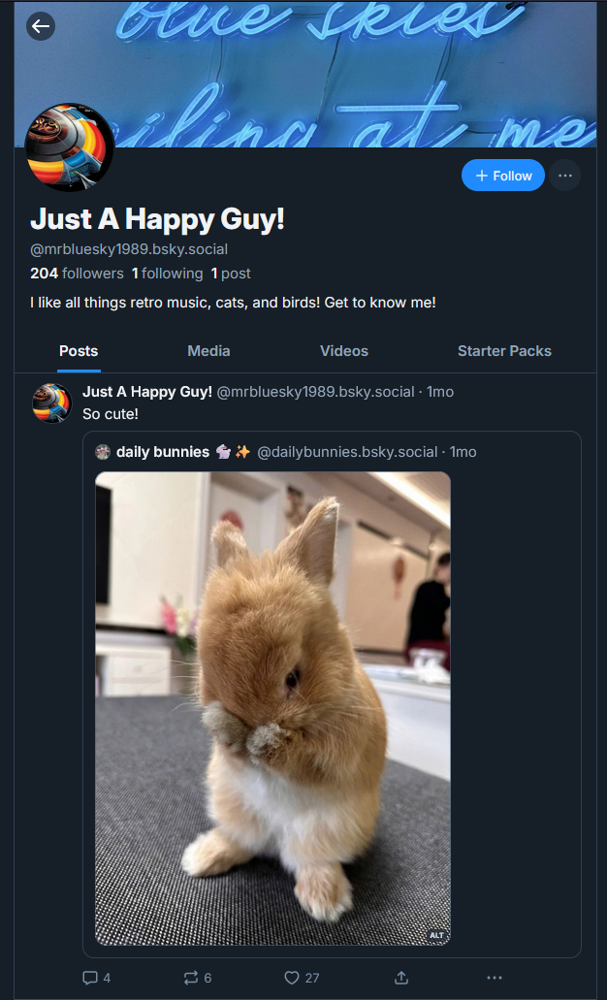
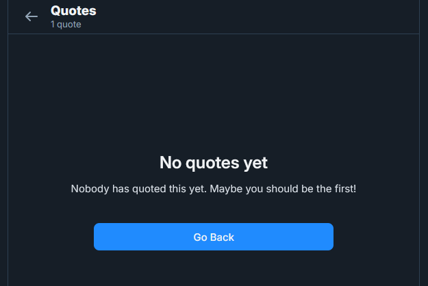
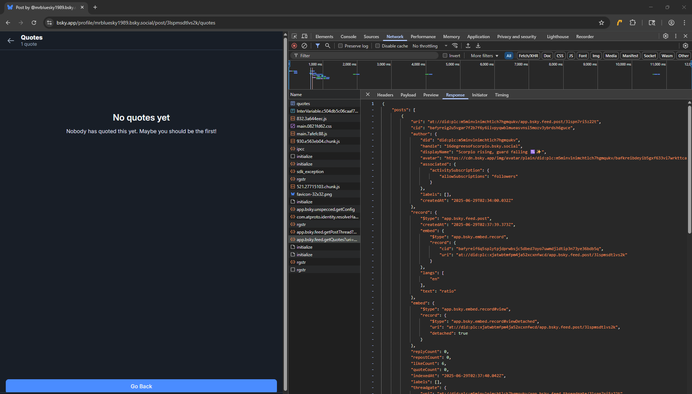
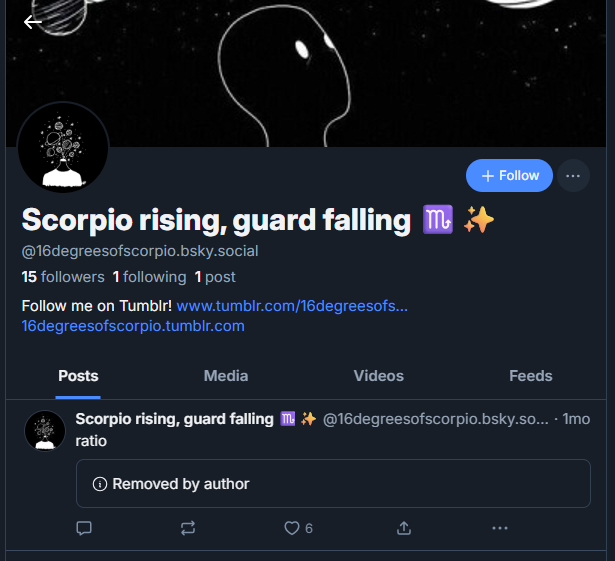
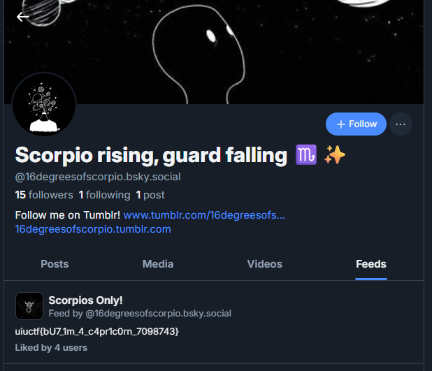
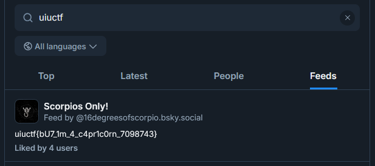

# "Bad Blood" Solution Writeup

This is a writeup is for the challenge "Bad Blood", the second of three OSINT challenges is a suite for UIUCTF 2025. This was intended a more tricky OSINT challenge introducing users to the concept of detached replies, as well as a fun quirk related to them.

## Intended Solution

We begin once again with the Mr. Blue Sky profile:



Additionally, we have a new description:

```
Mr. Blue Sky is just trying his best to build a following, but he's been trying to hide interactions from a particular troll! See if you can find something on that user's profile.
```

So we're looking for a hidden post, reply, or other interaction from some kind of troll. A few real-life trolls cluttered the page up with fake flags (such is the nature of social media OSINT I suppose), but after working through some clutter you might notice something odd: the post shown has one quote post that isn't actually associated with a user!



Why does this happen? Well it turns out that Bluesky lets you detach quote replies from posts you make. Presumably this is to minimize harassment, and it's a good idea, but it dosesn't quite fully detach the reply from the post. To see how, we need to look at the Networking tab on Inspect Element:



Weirdly, the API request for quote posts in the networking tab still returns a user! If you want a sort of solve "script" for this challenge, you can call the API to get the same result:

```bash
curl https://public.api.bsky.app/xrpc/app.bsky.feed.getQuotes?uri=at%3A%2F%2Fdid%3Aplc%3Axjatwbtmfpm4ja52xcxnfwcd%2Fapp.bsky.feed.post%2F3lspmsdtlvs2k&limit=30
```

Ultimately though, we want to reach the profile of the user and find a flag, so let's visit the user `@16degreesofscorpio.bsky.social`:



Some interesting content, but no flag quite yet. If we search around to the "feeds" tab though, we find it:



The flag for this challenge is `uiuctf{bU7_1m_4_c4pr1c0rn_7098743}`.

## Unintended Solution

The search bar strikes again! If you read the writeup for "Mr. Blue Sky", you'd know that there was an unintended solve where the solution would show up in the "users" tab. Well clever me thought putting the flag for this challenge in the description of a Feed was a great idea until I learned that their descriptions, too, were searchable:



This unintended solve definitely disappointed me more than the last one, but I still hope people had fun figuring this challenge out and at the very least, learned something neat about Bluesky after the fact.