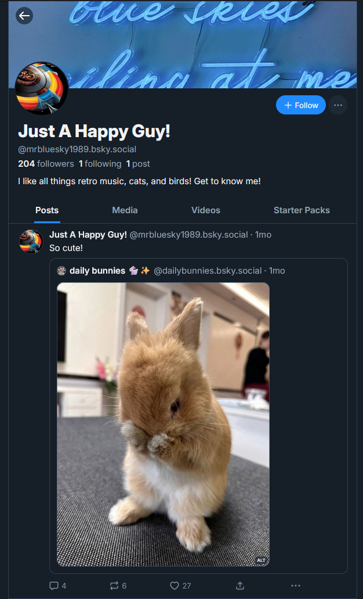
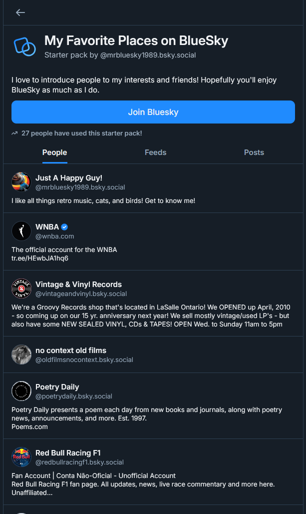
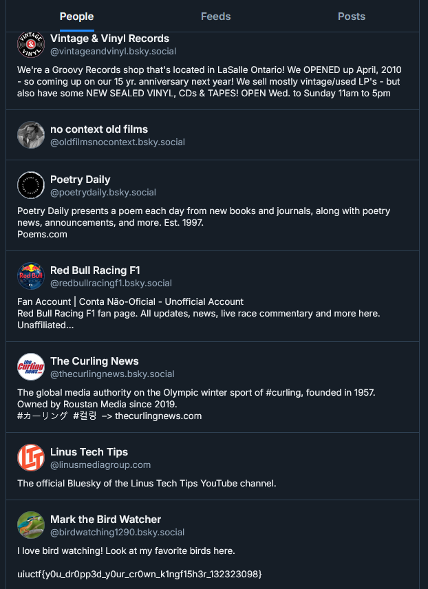
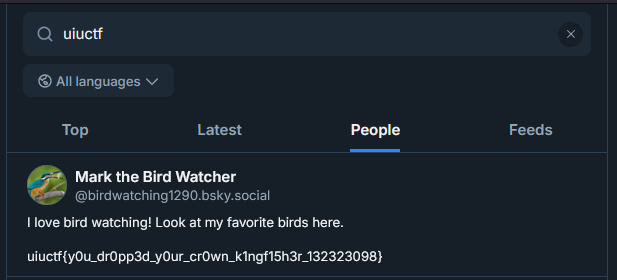

# "Mr. Blue Sky" Solution Writeup

This is a writeup is for the challenge "Mr. Blue Sky", the first of three OSINT challenges is a suite for UIUCTF 2025. This was intended to be a pretty easy challenge introducing people to basic Bluesky features unique to the platform, in this case Starter Packs.

## Intended Solve

We begin with the challenge description:

```
Mr. Blue Sky is your average go-lucky BlueSky user, but is there something more to his profile? See if you can find anything on [his profile](https://bsky.app/profile/mrbluesky1989.bsky.social).

This is the introduction to an OSINT suite. While all other OSINT challenges can be performed in any order, I recommend starting here.
```

When you get to the account page, you see a pretty normal Bluesky profile:



One feature unique to Bluesky that you see as a tab in this screenshot is the "Starter Pack". In order to simplify migration to the platform, Bluesky allows users to create a curated group of users and feeds. For Mr. Blue Sky, he just has a starter pack of his favorite accounts and feeds:



For OSINT purposes, this makes it pretty straightforward to find the user's friends. At the bottom of the friends list is another account, Mark the Bird Watcher (`@birdwatching1290.bsky.social`), as well as the flag:



The flag is `uiuctf{y0u_dr0pp3d_y0ur_cr0wn_k1ngf15h3r_132323098}`

## Unintended Solve

I would not have done my due dilligence if I didn't mention the unintended solve for this challenge. Something I did not consider with the placement of the flag was that, in searches, descriptions will show up as users:



While I certainly didn't mean for this to be a solution method, I hope you had fun with the challenge regardless of how you went about it!